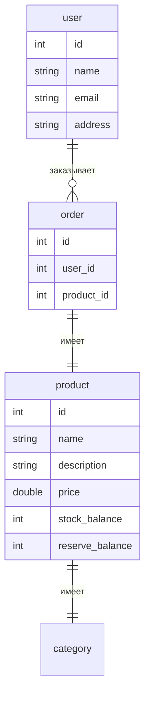
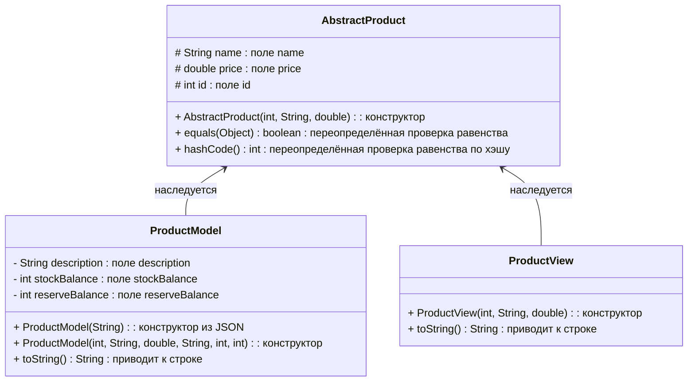

# ER модель таблиц предметной области

```mermaid
erDiagram
    user ||--o{ order : "заказывает"
    order ||--|| product : "имеет"
    product ||--|| category : "имеет"
    product {
        int id
        string name
        string description
        double price
        int stock_balance
        int reserve_balance
    }
    user {
        int id
        string name
        string email
        string address
    }
    order {
        int id
        int user_id
        int product_id
    }
```

# ER модель классов

```mermaid
classDiagram
direction BT
class AbstractProduct {
  + AbstractProduct(int, String, double) : конструктор
  # String name : поле name
  # double price : поле price
  # int id : поле id
  + equals(Object) boolean : переопределённая проверка равенства
  + hashCode() int : переопределённая проверка равенства по хэшу
}
class ProductModel {
  + ProductModel(String) : конструктор из JSON
  + ProductModel(int, String, double, String, int, int) : конструктор
  - String description : поле description
  - int stockBalance : поле stockBalance
  - int reserveBalance : поле reserveBalance
  + toString() String : приводит к строке
}
class ProductView {
  + ProductView(int, String, double) : конструктор
  + toString() String : приводит к строке
}

ProductModel  -->  AbstractProduct : наследуется
ProductView  -->  AbstractProduct : наследуется
```
