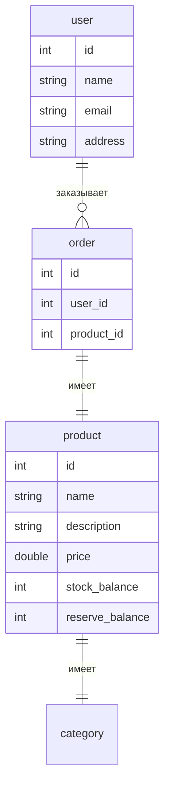

# ЛР 1

## Тема

Онлайн-магазин.

## ER модель

### Описание таблиц

1. user Пользователь:
    - id: уникальный идентификатор
    - first_name, middle_name, last_name: ФИО пользователя
    - email: email адрес пользователя
    - address: адрес пользователя

2. order Заказ:
    - id: уникальный идентификатор - primary key
    - user_id: foreign key к id пользователя
    - product_id: foreign key к id продукта

3. product Продукт:
    - id: уникальный идентификатор - primary key
    - name: наименование продукта
    - description: описание продукта
    - price: цена продукта
    - stockBalance: кол-во продукта на складе
    - reserveBalance: кол-во зарезервированного продукта на складе

## Выбранная сущность

Выбрана независимая сущность `product` "Продукт"
