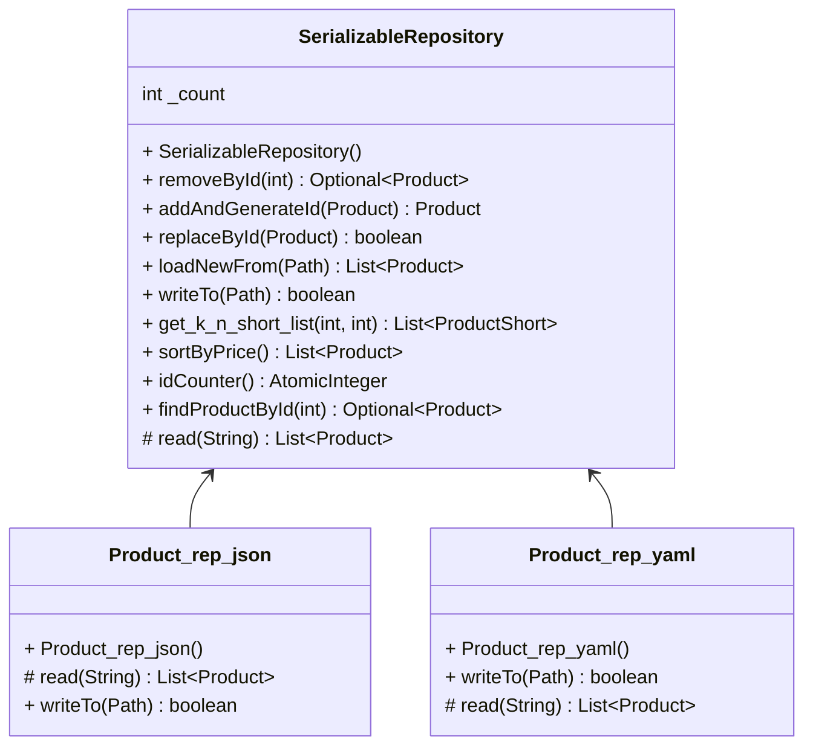

# er диаграмма JSON и YAML классов

```mermaid
classDiagram
direction BT
class Product_rep_json {
  + Product_rep_json() 
  # read(String) List~Product~
  + writeTo(Path) boolean
}
class Product_rep_yaml {
  + Product_rep_yaml() 
  + writeTo(Path) boolean
  # read(String) List~Product~
}
class SerializableRepository {
  + SerializableRepository() 
  + removeById(int) Optional~Product~
  + addAndGenerateId(Product) Product
  + replaceById(Product) boolean
  + loadNewFrom(Path) List~Product~
  + writeTo(Path) boolean
  + get_k_n_short_list(int, int) List~ProductShort~
  + sortByPrice() List~Product~
  + idCounter() AtomicInteger
  + findProductById(int) Optional~Product~
  # read(String) List~Product~
   int _count
}

Product_rep_json  -->  SerializableRepository 
Product_rep_yaml  -->  SerializableRepository 
```
